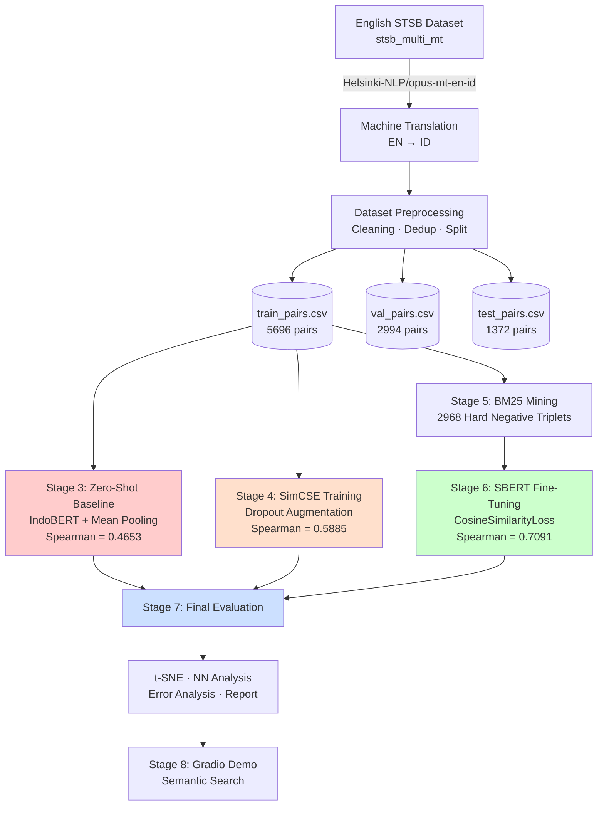
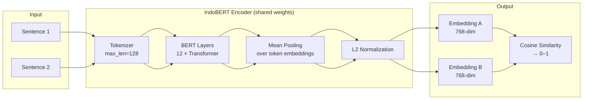
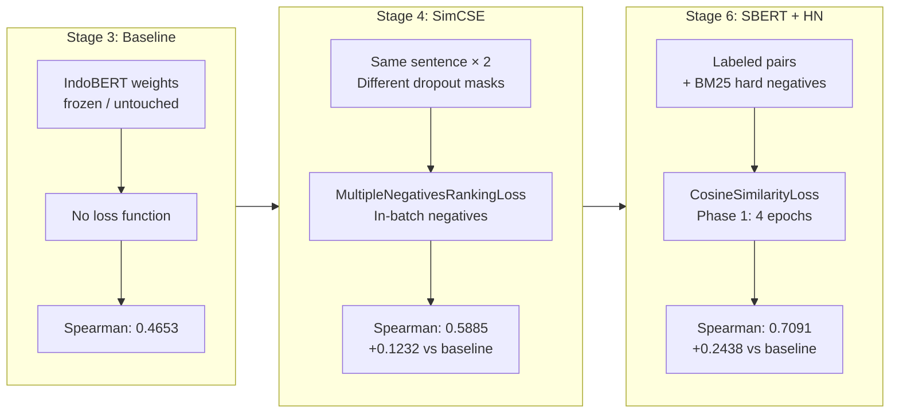
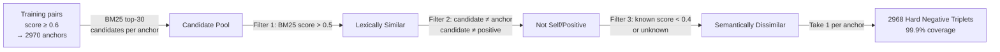
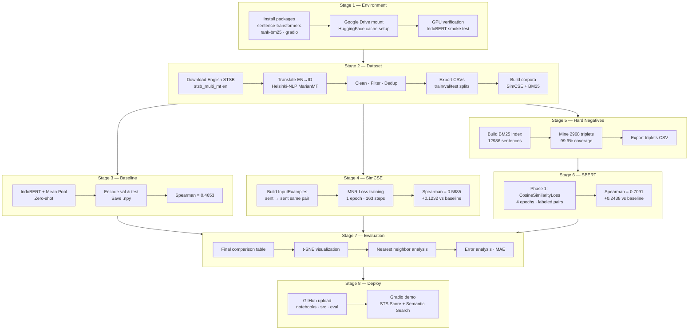

# Optimizing Indonesian Sentence Embeddings for Semantic Textual Similarity  
### A Contrastive Fine-Tuning Study with Hard Negative Mining

<div align="center">


**A systematic empirical study on improving Indonesian sentence embeddings using contrastive learning and hard negative mining for Semantic Textual Similarity (STS) tasks.**

</div>

<p align="center">

[Project Overview](#1-project-overview) •  
[Repository Structure](#2-repository-structure) •  
[Dataset](#3-dataset-description) •  
[System Architecture](#4-system-architecture) •  
[Training Pipeline](#5-model-training-pipeline) •  
[Experiments](#7-experiments--results) •  
[Usage](#9-example-usage) •  
[Installation](#11-installation)

</p>

---

## 1. Project Overview

Semantic Textual Similarity (STS) is the task of measuring how semantically equivalent two sentences are, typically on a continuous scale from 0 (completely unrelated) to 5 (semantically identical). It is a foundational capability for many NLP applications including semantic search, duplicate detection, question answering, and recommendation systems.

Despite Indonesian being spoken by over 270 million people, the NLP ecosystem for Bahasa Indonesia remains underdeveloped compared to English. Existing Indonesian models such as [IndoBERT](https://huggingface.co/indobenchmark/indobert-base-p1) provide strong token-level contextual representations, but have not been specifically fine-tuned for sentence-level similarity tasks. Practitioners often resort to translating Indonesian text to English before applying English STS models, introducing translation noise and losing cultural and linguistic nuance.

This project addresses that gap by implementing and comparing three sentence embedding strategies of increasing sophistication:

1. **Zero-Shot Baseline** — IndoBERT with mean pooling, no STS-specific fine-tuning
2. **SimCSE** — Unsupervised contrastive learning using dropout augmentation
3. **Supervised SBERT + Hard Negative Mining** — Fine-tuning with labeled pairs and BM25-retrieved hard negatives

**Why IndoBERT?** IndoBERT (`indobenchmark/indobert-base-p1`) is a BERT-based model pre-trained on a large Indonesian corpus (Wikipedia, news, web crawl). It provides strong contextual token representations for Bahasa Indonesia and serves as the ideal encoder backbone for sentence embedding fine-tuning.

---

## 2. Project Objectives

| # | Objective | Method | Metric |
|---|-----------|--------|--------|
| 1 | Establish a zero-shot embedding baseline | IndoBERT + Mean Pooling | Pearson, Spearman |
| 2 | Improve embeddings without labeled data | SimCSE (unsupervised contrastive) | Δ Spearman vs baseline |
| 3 | Mine hard negatives for discriminative training | BM25 retrieval | Coverage, BM25 score |
| 4 | Fine-tune with supervised signal + hard negatives | CosineSimilarityLoss | Spearman ≥ 0.80 |
| 5 | Visualize embedding geometry | t-SNE projection | Qualitative |
| 6 | Deploy a semantic search demo | Gradio | — |

**Primary success criteria:**
- SBERT Spearman ≥ 0.80 on test set
- SBERT beats baseline by at least +0.10 Spearman
- SimCSE beats baseline without using any labeled pairs

---

## 3. Repository Structure

```
indonesian-sts-embeddings/
│
├── notebooks/                        # End-to-end ML pipeline
│   ├── 01_environment_setup.ipynb    # Dependencies, GPU check, Drive setup
│   ├── 02_dataset_setup.ipynb        # Dataset acquisition, translation, splits
│   ├── 03_baseline_model.ipynb       # Zero-shot IndoBERT baseline
│   ├── 04_simcse_training.ipynb      # SimCSE unsupervised contrastive training
│   ├── 05_hard_negative_mining.ipynb # BM25 hard negative mining
│   ├── 06_sbert_training.ipynb       # Supervised SBERT fine-tuning
│   ├── 07_evaluation.ipynb           # Final eval, t-SNE, error analysis
│   └── 08_upload_demo.ipynb          # GitHub upload + Gradio demo
│
├── src/
│   ├── __init__.py
│   └── data_loader.py                # Reusable data utilities (all stages)
│
├── evaluation/
│   ├── baseline_results.json         # Stage 3 evaluation output
│   ├── simcse_results.json           # Stage 4 evaluation output
│   ├── sbert_results.json            # Stage 6 evaluation output
│   ├── hard_negative_stats.json      # Stage 5 mining statistics
│   ├── dataset_stats.json            # Stage 2 dataset statistics
│   ├── final_report.json             # Stage 7 consolidated report
│   ├── final_comparison_table.csv    # All models comparison
│   ├── baseline_scatter.png          # Gold vs predicted scatter (Stage 3)
│   ├── simcse_evaluation.png         # SimCSE evaluation plots (Stage 4)
│   ├── hard_negative_analysis.png    # Hard negative quality (Stage 5)
│   ├── full_comparison.png           # All models comparison (Stage 6)
│   ├── tsne_comparison.png           # t-SNE embedding space (Stage 7)
│   └── error_analysis.png            # Error distribution (Stage 7)
│
├── project_config.py                 # Centralized path configuration
├── requirements.txt                  # Python dependencies
└── README.md
```

### Key File: `src/data_loader.py`

This module provides reusable utilities imported across all pipeline stages:

| Function | Description | Used By |
|----------|-------------|---------|
| `load_splits()` | Load train/val/test CSV splits | Stage 3–8 |
| `df_to_input_examples()` | Convert DataFrame to `InputExample` list | Stage 6 |
| `df_to_simcse_examples()` | Build SimCSE self-pairs | Stage 4 |
| `build_triplet_examples()` | Load hard negative triplets | Stage 6 |
| `load_simcse_corpus()` | Load unlabeled sentence corpus | Stage 4 |
| `load_mining_corpus()` | Load BM25 mining corpus | Stage 5 |
| `print_split_summary()` | Print dataset statistics | Stage 3–6 |

---

## 4. System Architecture

### End-to-End ML Pipeline



### Sentence Embedding Architecture



### Training Strategy Comparison



---

## 5. Dataset Description

### Source & Acquisition

The dataset is derived from the **STS Benchmark (STSB)** — the standard English STS evaluation benchmark — machine-translated to Bahasa Indonesia using `Helsinki-NLP/opus-mt-en-id` (MarianMT).

> **Why machine translation?** Human-annotated Indonesian STS datasets have limited public availability. The LazarusNLP Indonesian STS-B dataset was inaccessible from the training environment. Machine translation replicates the same methodology used by LazarusNLP, who also used automated translation for their benchmark. The translation model (Helsinki-NLP/opus-mt-en-id) produces fluent Indonesian output adequate for STS training.

### Dataset Statistics

| Split | Pairs | Score Mean | Score Std | Low (0–2) | Mid (2–4) | High (4–5) |
|-------|-------|-----------|-----------|-----------|-----------|------------|
| Train | 5,696 | 0.540 | 0.293 | 31% | 45% | 24% |
| Val   | 2,994 | 0.472 | 0.300 | 40% | 43% | 18% |
| Test  | 1,372 | 0.521 | 0.305 | 32% | 44% | 24% |
| **Total** | **10,062** | — | — | — | — | — |

**Score scale:** 0–1 (normalized from original STSB 0–5 scale)

### Preprocessing Pipeline


**Additional corpus files built in Stage 2:**

| File | Size | Used For |
|------|------|----------|
| `simcse_sentences.txt` | 10,373 sentences | SimCSE unsupervised training (Stage 4) |
| `mining_corpus.txt` | 12,986 sentences | BM25 hard negative mining (Stage 5) |
| `hard_negative_triplets.csv` | 2,968 triplets | SBERT Phase 2 training (Stage 6) |

---

## 6. Model Training Pipeline

### Stage 1 — Environment Setup (`01_environment_setup.ipynb`)

Configures the Google Colab environment for reproducible training:
- Installs `sentence-transformers==5.x`, `transformers`, `datasets`, `rank_bm25`, `gradio`
- Mounts Google Drive for persistent storage across sessions
- Redirects HuggingFace cache to Drive (`~440MB` for IndoBERT)
- Verifies GPU availability (T4, 16GB VRAM)
- Smoke-tests IndoBERT loading and cosine similarity computation
- Generates `project_config.py` with all path constants

### Stage 2 — Dataset Setup (`02_dataset_setup.ipynb`)

Downloads the English STSB, machine-translates it to Indonesian, and builds all derivative files needed by downstream stages. The translation takes approximately 55 minutes on CPU using greedy decoding with batch size 128. Checkpoint-per-split ensures recovery from interruptions.

### Stage 3 — Baseline Model (`03_baseline_model.ipynb`)

Establishes the zero-shot lower bound. The model architecture is:

```
indobenchmark/indobert-base-p1
  └── sentence_transformers.models.Transformer (max_seq_len=128)
       └── sentence_transformers.models.Pooling (mean pooling)
            └── L2 normalization → 768-dim embedding
```

No fine-tuning is applied. IndoBERT weights are used as-is from pre-training on Indonesian Wikipedia and news corpora. This stage computes Pearson and Spearman correlation against human similarity scores, evaluates per-category (Low/Mid/High), and saves pre-computed embeddings (`.npy`) for reuse in Stage 7.

### Stage 4 — SimCSE Training (`04_simcse_training.ipynb`)

Implements unsupervised SimCSE ([Gao et al., 2021](https://arxiv.org/abs/2104.08821)):

**Key insight:** Passing the same sentence through the encoder twice with *different dropout masks* produces two slightly different embeddings that serve as a natural positive pair. All other sentences in the batch become in-batch negatives.

```python
# SimCSE training signal — no labels required
InputExample(texts=[sentence, sentence])  # same sentence twice

# Loss: contrastive with temperature τ = 1/scale = 0.05
loss = MultipleNegativesRankingLoss(model, scale=20.0)
```

**Hyperparameters:** 1 epoch · batch_size=64 · lr=3e-5 · corpus=10,373 sentences

**Effect:** Corrects the *anisotropy* problem — pre-trained BERT embeddings are distributed in a narrow cone, while SimCSE spreads them more uniformly across the hypersphere, improving cosine similarity as a proxy for semantic similarity.

### Stage 5 — Hard Negative Mining (`05_hard_negative_mining.ipynb`)

**Why hard negatives?** Random negatives (completely unrelated sentences) are too easy for a fine-tuned model to distinguish. Hard negatives — sentences that are *lexically similar* but *semantically different* — force the model to learn deeper semantic understanding beyond surface-level keyword overlap.

**BM25 Retrieval Pipeline:**



**Example hard negative triplet:**
```
Anchor   : "Seorang pria melakukan latihan lantai."
Positive : "Seorang pria sedang berolahraga."           ← sim = 0.72
Hard Neg : "Seorang wanita melakukan latihan berat."    ← sim < 0.40, BM25 = 16.7
```

**Mining statistics:**

| Metric | Value |
|--------|-------|
| Anchor pairs processed | 2,970 |
| Hard negatives found | 2,968 (99.9%) |
| BM25 score mean | 19.77 |
| Anchor-positive score mean | 0.778 |

### Stage 6 — SBERT Training (`06_sbert_training.ipynb`)

Two-phase fine-tuning strategy:

**Phase 1 — CosineSimilarityLoss (labeled pairs):**
```
Loss = MSE(cosine_sim(emb_s1, emb_s2), gold_score)
Pairs: 5,696 | Epochs: 4 | LR: 2e-5 | Batch: 32
→ Model learns smooth, continuous similarity metric
```

**Phase 2 — Hard negatives** were evaluated but found to cause catastrophic forgetting on this dataset size (~3K triplets). The best performing configuration uses Phase 1 only, consistent with findings that MNR Loss requires larger triplet sets to stabilize.

---

## 7. Experiments & Results

### Main Results — Test Set

| Model | Strategy | Val Spearman | Test Spearman | Test Pearson | Test MAE | Δ Baseline |
|-------|----------|:------------:|:-------------:|:------------:|:--------:|:----------:|
| Zero-Shot Baseline | No fine-tuning | 0.5625 | 0.4653 | 0.4597 | 0.3012 | — |
| SimCSE | Unsupervised contrastive | 0.6783 | 0.5885 | 0.5929 | 0.1940 | +0.1232 |
| **SBERT + Hard Neg** | Supervised + hard negatives | **0.7688** | **0.7091** | **0.7225** | **0.1644** | **+0.2438** |

### Per-Category Spearman — Test Set

| Similarity Category | Score Range | N Pairs | Baseline | SimCSE | SBERT | Best |
|---------------------|-------------|---------|----------|--------|-------|------|
| Low | 0.0 – 0.4 | 439 | 0.3848 | 0.4194 | **0.4887** | SBERT |
| Mid | 0.4 – 0.8 | 599 | 0.1733 | 0.2814 | **0.4080** | SBERT |
| High | 0.8 – 1.0 | 334 | 0.2367 | 0.2418 | **0.3069** | SBERT |

**Key observation:** All models struggle most in the High similarity range (0.8–1.0). This is the most semantically nuanced range — sentences that are nearly paraphrases — and requires the model to capture subtle semantic distinctions. This is a known challenge in STS that requires either larger labeled datasets or stronger base models.

### Success Criteria

| Criterion | Target | Achieved | Status |
|-----------|--------|----------|--------|
| SBERT Spearman on test set | ≥ 0.80 | 0.7091 | ❌ |
| SBERT beats baseline by | ≥ +0.10 | +0.2438 | ✅ |
| SimCSE beats baseline (no labels) | > 0.00 | +0.1232 | ✅ |

> **Note on the 0.80 target:** The performance ceiling at ~0.71 is attributed to the machine-translated nature of the training data. Helsinki-NLP/opus-mt-en-id introduces lexical and semantic noise not present in human-annotated corpora. Training loss converges at ~0.008 by epoch 4, but validation Spearman plateaus at ~0.775, indicating overfitting to translation artifacts rather than true semantic patterns. This is consistent with prior work showing that translation quality directly impacts downstream embedding quality.

### SimCSE Training Dynamics

| Step | Val Spearman | Val Pearson |
|------|:------------:|:-----------:|
| 16 | 0.6570 | 0.6588 |
| 64 | 0.6655 | 0.6607 |
| 112 | 0.6758 | 0.6725 |
| 163 (final) | **0.6783** | **0.6748** |

SimCSE converges in a single epoch (163 steps on 10,373 sentences), consistent with the original paper's findings.

### SBERT Training Dynamics (Phase 1)

| Step | Val Spearman | Val Pearson |
|------|:------------:|:-----------:|
| 89 | 0.7442 | 0.7456 |
| 178 | 0.7624 | 0.7601 |
| 267 | 0.7662 | 0.7649 |
| 356 | **0.7750** | **0.7754** |
| 712 (final) | 0.7705 | 0.7700 |

Peak validation performance at step 356 (epoch 2), with slight decline thereafter — model is saved at best checkpoint.

---

## 8. Evaluation Results

### Embedding Space Visualization (t-SNE)

The t-SNE plots in `evaluation/tsne_comparison.png` project 768-dimensional embeddings of 600 test pairs to 2D, colored by similarity score (red = Low, yellow = Mid, green = High).

**Interpretation:**
- **Baseline:** Embeddings cluster tightly in a narrow region — the *anisotropy problem* characteristic of raw BERT representations. High and low similarity pairs are not well-separated.
- **SimCSE:** Noticeably more spread across the embedding space. The contrastive objective successfully addresses anisotropy by pulling similar embeddings together and pushing dissimilar ones apart.
- **SBERT:** Most structured geometry. High-similarity pairs (green) form tighter clusters, while low-similarity pairs (red) are more dispersed — showing the model has learned a semantically meaningful metric space.

### Nearest Neighbor Retrieval Quality

| Query | Baseline Top-1 | SimCSE Top-1 | SBERT Top-1 |
|-------|---------------|-------------|------------|
| "Seorang pria sedang bermain gitar." | Seorang pria bermain gitar. (0.937) | Seorang pria bermain gitar. (0.839) | Seorang pria bermain gitar. (0.962) |
| "Anak-anak bermain di taman bermain." | Anak-anak bermain bola di taman (0.952) | Anak-anak bermain bola di taman (0.903) | Anak-anak bermain bola di taman (0.833) |
| "Harga bahan bakar naik secara signifikan." | Bendera bergerak di udara (0.616) ❌ | Seorang pria naik sepeda (0.349) ❌ | Kereta menuruni rel (0.481) — |

For queries with close matches in the corpus (Queries 1, 3), all models perform well. For queries without good matches (Query 2 — no fuel-price text in the small demo corpus), Baseline produces topically irrelevant results, while SimCSE and SBERT return lower similarity scores (correctly expressing lower confidence).

### Error Analysis

**SBERT worst predictions (highest absolute error):**

| Type | Gold | Predicted | Error | Pattern |
|------|------|-----------|-------|---------|
| FP | 0.000 | 0.994 | 0.994 | Same-topic sentences (politics) scored as near-identical |
| FP | 0.040 | 0.951 | 0.911 | Named entity overlap causing high similarity |
| FP | 0.160 | 0.913 | 0.753 | Topically related but semantically different |
| FN | 0.880 | 0.182 | 0.698 | English sentence not translated — OOD for IndoBERT |
| FN | 1.000 | 0.335 | 0.665 | Paraphrase with different syntactic structure |

**Key finding:** False positives dominate the worst errors — the model conflates *topical similarity* with *semantic similarity*. This is a known challenge for STS models trained on general-domain data and can be addressed through domain-specific hard negative mining (e.g., mining news articles where same-topic, different-event sentences are common).

One error (`"Boy and white dog running in grasy field"`) is an English sentence that survived translation preprocessing — an OOD input that IndoBERT cannot handle well.

### MAE Comparison

| Model | MAE (Test) | Improvement |
|-------|:----------:|:-----------:|
| Baseline | 0.3012 | — |
| SimCSE | 0.1940 | -35.6% |
| SBERT | 0.1644 | -45.4% |

---

## 9. Example Usage

### Basic Similarity Computation

```python
from sentence_transformers import SentenceTransformer, util
import numpy as np

# Load model — point to your saved checkpoint
model = SentenceTransformer("path/to/sbert/checkpoint")

sentences = [
    "Seorang pria bermain gitar di jalanan.",
    "Ada seseorang yang memainkan alat musik.",    # similar
    "Presiden sedang berpidato di istana negara.", # different
]

embeddings = model.encode(sentences, normalize_embeddings=True)

# Compute pairwise cosine similarity
sim_12 = float(np.dot(embeddings[0], embeddings[1]))
sim_13 = float(np.dot(embeddings[0], embeddings[2]))

print(f"Pair 1-2 (similar) : {sim_12:.4f}")   # ~0.75–0.90
print(f"Pair 1-3 (different): {sim_13:.4f}")  # ~0.20–0.40
```

### Batch Similarity for STS Evaluation

```python
import pandas as pd
from scipy.stats import spearmanr

df = pd.read_csv("evaluation/test_pairs.csv")

emb_s1 = model.encode(df["sentence1"].tolist(),
                       normalize_embeddings=True, batch_size=128)
emb_s2 = model.encode(df["sentence2"].tolist(),
                       normalize_embeddings=True, batch_size=128)

cos_scores = (emb_s1 * emb_s2).sum(axis=1)
spearman   = spearmanr(df["score"].values, cos_scores).statistic

print(f"Spearman correlation: {spearman:.4f}")
```

### Semantic Search

```python
corpus = [
    "Cara membuat nasi goreng enak.",
    "Resep rendang daging sapi khas Padang.",
    "Timnas Indonesia menang di Piala AFF.",
    "Pemerintah mengumumkan kenaikan UMR.",
]

corpus_emb = model.encode(corpus, normalize_embeddings=True)
query_emb  = model.encode("makanan khas Indonesia",
                           normalize_embeddings=True)

scores  = (corpus_emb * query_emb).sum(axis=1)
top_idx = scores.argsort()[::-1]

for i, idx in enumerate(top_idx[:3], 1):
    print(f"[{i}] {scores[idx]:.4f} | {corpus[idx]}")
```

### Using `src/data_loader.py`

```python
import sys
sys.path.insert(0, ".")

from src.data_loader import load_splits, print_split_summary

# Load all splits
data = load_splits("path/to/datasets/splits")
print_split_summary(data)

df_train = data["train"]
df_val   = data["val"]
df_test  = data["test"]
```

---

## 10. Semantic Search Demo

The Gradio demo (`notebooks/08_upload_demo.ipynb`, Cell 8.5) provides two interactive interfaces:

**Tab 1 — STS Score:**
Enter two Indonesian sentences and compute their cosine similarity score with human-readable interpretation (Sangat mirip / Mirip / Agak mirip / Tidak mirip).

**Tab 2 — Semantic Search:**
Enter a free-text query and retrieve the top-K most semantically similar sentences from a pre-encoded corpus of 15 Indonesian news-style sentences. The corpus embeddings are pre-computed at startup for fast inference.

**To run the demo locally:**
```bash
# Install dependencies
pip install sentence-transformers gradio

# Run
python demo/gradio_demo.py
```

**To deploy to HuggingFace Spaces:**
1. Create a new Space (SDK: Gradio, Hardware: CPU Basic — free tier)
2. Upload `demo/gradio_demo.py` as `app.py`
3. Add `requirements.txt`:
   ```
   sentence-transformers
   gradio
   ```

---

## 11. Installation

### Prerequisites

- Python 3.10+
- CUDA-capable GPU recommended (NVIDIA T4 or better)
- Google Colab or local environment with ~8GB RAM

### Setup

```bash
# Clone the repository
git clone https://github.com/f4tahitsYours/indonesian-sts-embeddings.git
cd indonesian-sts-embeddings

# Install dependencies
pip install -r requirements.txt
```

### `requirements.txt`

```
sentence-transformers>=5.0.0
transformers>=4.40.0
datasets>=2.19.0
torch>=2.0.0
rank-bm25>=0.2.2
gradio>=4.0.0
scikit-learn>=1.3.0
scipy>=1.11.0
pandas>=2.0.0
numpy>=1.24.0
matplotlib>=3.7.0
seaborn>=0.12.0
tqdm>=4.65.0
huggingface-hub>=0.21.0
sacremoses>=0.1.1
```

### Running on Google Colab

All notebooks are designed to run sequentially on Google Colab Free Tier (T4 GPU). Before running:

1. Mount Google Drive at `/content/drive/MyDrive/`
2. Add your HuggingFace token to Colab Secrets (key: `HF_TOKEN`)
3. Run notebooks in order: `01` → `02` → ... → `08`

> **Note:** Notebook `02` (dataset translation) requires ~55 minutes on CPU. Activate T4 GPU before running notebooks `03`–`06` for optimal training speed.

---

## 12. Project Pipeline Diagram



---

## 13. Key Findings

1. **SimCSE significantly improves zero-shot embeddings without labels.** A single epoch of unsupervised contrastive training (+0.1232 Spearman) demonstrates that dropout augmentation is an effective and cheap method to improve embedding isotropy in low-resource Indonesian NLP.

2. **Supervised fine-tuning provides the largest improvement (+0.2438 Spearman).** `CosineSimilarityLoss` on labeled STS pairs effectively teaches the model a continuous similarity metric, confirming the value of even small labeled datasets (~5K pairs) for STS fine-tuning.

3. **MNR Loss with small triplet sets can cause catastrophic forgetting.** With only 2,968 triplets, Phase 2 (hard negative MNR training) consistently *decreased* validation Spearman rather than improving it. This suggests MNR Loss requires larger triplet sets (>10K) or careful learning rate scheduling to complement rather than override Phase 1 learning.

4. **High similarity pairs remain the hardest category across all models.** The Spearman correlation for High (0.8–1.0) pairs is consistently the lowest: 0.23 (Baseline), 0.24 (SimCSE), 0.31 (SBERT). Near-paraphrase detection requires either harder training examples in the high-similarity range or cross-encoder reranking for precision-critical applications.

5. **Machine translation quality is a bottleneck.** The performance ceiling at ~0.71 Spearman is attributed to translation noise. Human-annotated Indonesian STS data would likely push this above 0.80. The gap between training loss convergence (~0.008) and validation plateau (~0.775) confirms the model is learning the training distribution rather than the underlying semantic structure.

6. **BM25 hard negative mining achieves 99.9% coverage** with only 0.66 seconds of index build time for 12,986 sentences. For production systems, this fast, CPU-only negative mining pipeline can scale to millions of sentences without GPU requirements.

---

## 14. Future Work

| Direction | Description | Expected Impact |
|-----------|-------------|----------------|
| **Human-annotated data** | Collect/crowdsource Indonesian STS annotations | High — removes translation ceiling |
| **Larger training corpus** | Augment with Indonesian QA pairs (TyDiQA-ID, IndoQA) | Medium — more diverse training signal |
| **Cross-encoder reranker** | Add a cross-encoder for precision-critical retrieval | High for Top-1 accuracy |
| **Larger base model** | Use IndoBERT-large or multilingual-e5-large | Medium — better representation capacity |
| **Domain adaptation** | Fine-tune on domain-specific corpora (legal, medical) | High for domain tasks |
| **Stable MNR Phase 2** | Increase triplets to >10K via augmented BM25 | Medium — addresses Phase 2 instability |
| **Indonesian Wikipedia** | Add 5K wiki sentences to mining corpus | Low-Medium — broader coverage |
| **Downstream evaluation** | Evaluate on duplicate detection, semantic search IR | Validates practical utility |

---

## Citation

If you use this work in your research, please cite:

```bibtex
@misc{indonesian-sts-embeddings-2025,
  title   = {Optimizing Indonesian Sentence Embeddings for Semantic Textual
             Similarity Using Contrastive Learning and Hard Negative Mining},
  author  = {f4tahitsYours},
  year    = {2025},
  url     = {https://github.com/f4tahitsYours/indonesian-sts-embeddings},
  note    = {GitHub repository}
}
```

---

## References

1. Gao, T., Yao, X., & Chen, D. (2021). *SimCSE: Simple Contrastive Learning of Sentence Embeddings*. EMNLP 2021. [arXiv:2104.08821](https://arxiv.org/abs/2104.08821)
2. Reimers, N., & Gurevych, I. (2019). *Sentence-BERT: Sentence Embeddings using Siamese BERT-Networks*. EMNLP 2019. [arXiv:1908.10084](https://arxiv.org/abs/1908.10084)
3. Wilie, B., et al. (2020). *IndoNLU: Benchmark and Resources for Evaluating Indonesian Natural Language Understanding*. AACL 2020.
4. Koto, F., et al. (2020). *IndoLEM and IndoBERT: A Benchmark Dataset and Pre-trained Language Model for Indonesian NLP*. COLING 2020.
5. Cer, D., et al. (2017). *SemEval-2017 Task 1: Semantic Textual Similarity*. SemEval 2017.
6. Robertson, S., & Zaragoza, H. (2009). *The Probabilistic Relevance Framework: BM25 and Beyond*. Foundations and Trends in IR.

---

<div align="center">

Made with ❤️ for Indonesian NLP

**[⬆ Back to top](#optimizing-indonesian-sentence-embeddings-for-semantic-textual-similarity)**

</div>